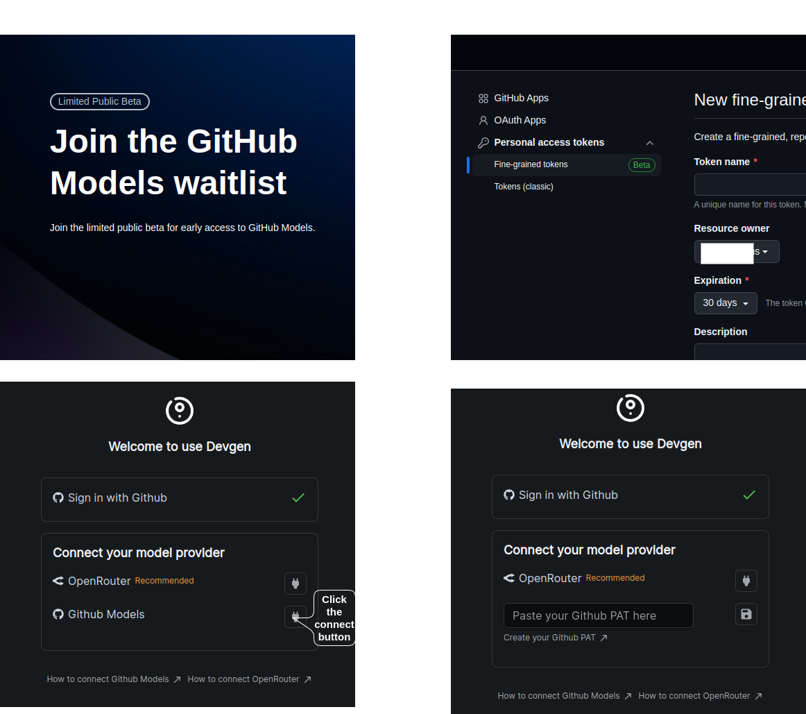

# Connect To Github Models

1. Before connecting to GitHub Models, you must have access to GitHub Models. [Apply](https://github.com/marketplace/models/waitlist/join) for access if you do not have it already.

2. [Create](https://github.com/settings/personal-access-tokens/new) a GitHub Personal Access Token (PAT) and paste it into Devgen.

