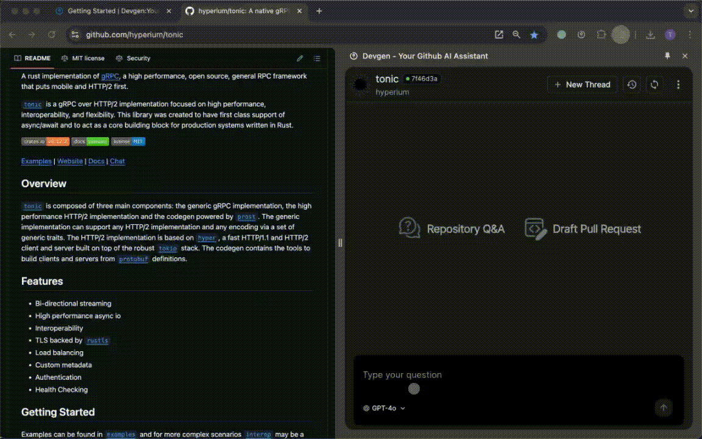
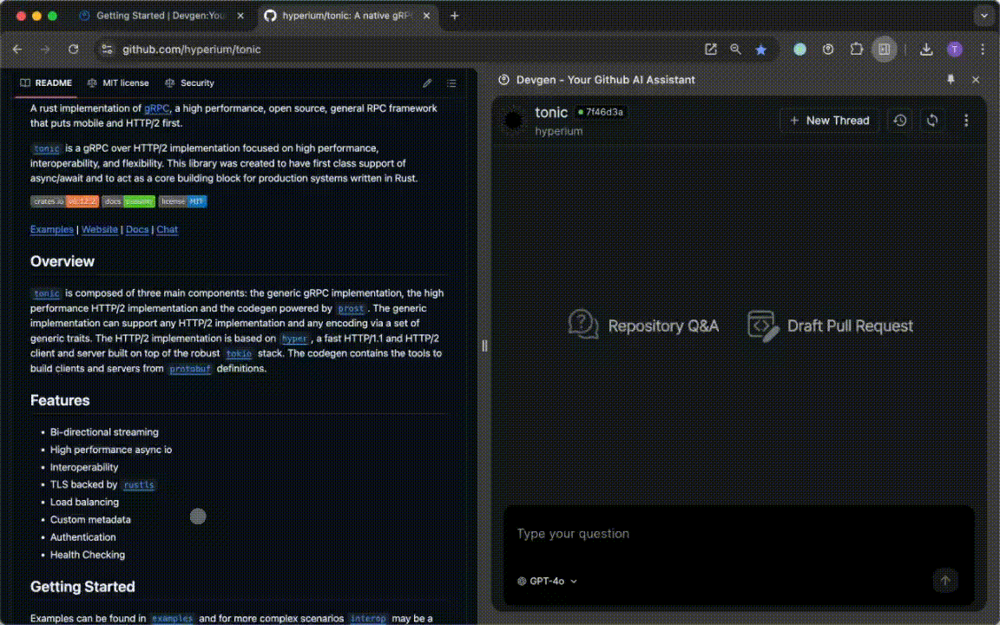

# Repository Q&A

## Direct Q&A

Just send the question to Devgen directly. Devgen will load the related repository context and summary for your question

## Conext Q&A

Select the context and ask question

## Use Cases

The feature of Repository Q&A is recommanded with following use cases
1. find the usage example
2. take deep insight the implementation details
3. explain the code and concept